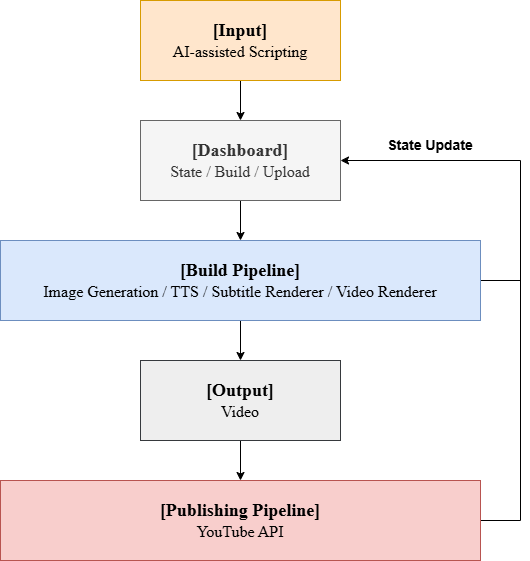
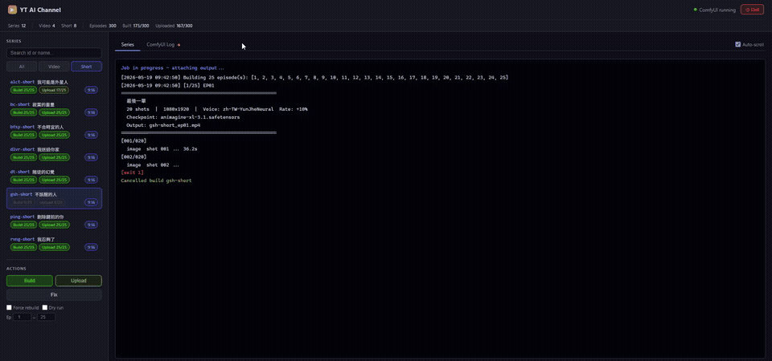

# AI Video Generation Pipeline

A local AI pipeline that scripts, renders, and publishes YouTube Shorts with zero per-video API cost.

## Demo

<a href="https://www.youtube.com/@one-book-story" target="_blank">View full channel</a>

## Architecture

## Dashboard

## Design Decisions

- **Zero marginal cost:** Scripting is done manually via an AI assistant subscription (flat cost). Image generation and TTS run entirely on local hardware — no per-call API fees regardless of volume.
- **Human-in-the-loop:** A human authors each episode script with AI assistance, keeping creative control while automating everything downstream.
- **Separation of build and publish:** The dashboard manages build and upload as independent steps, allowing review before any video goes live.

## Build Performance

Tested on local hardware:

| Component | Spec |
|---|---|
| CPU | Intel Core i5-14400F |
| GPU | NVIDIA GeForce RTX 3060 |
| RAM | 16GB |

Per episode (20 shots, 1080x1920):

- Image generation: ~15s / shot (GPU)
- FFmpeg assembly: ~96s
- Total build time: ~6m 43s
- Output: ~1.7 min video, ~96–110 MB

## License

Copyright (c) 2026 Jerry Chen. All rights reserved. This repository is for portfolio and demonstration purposes only.

